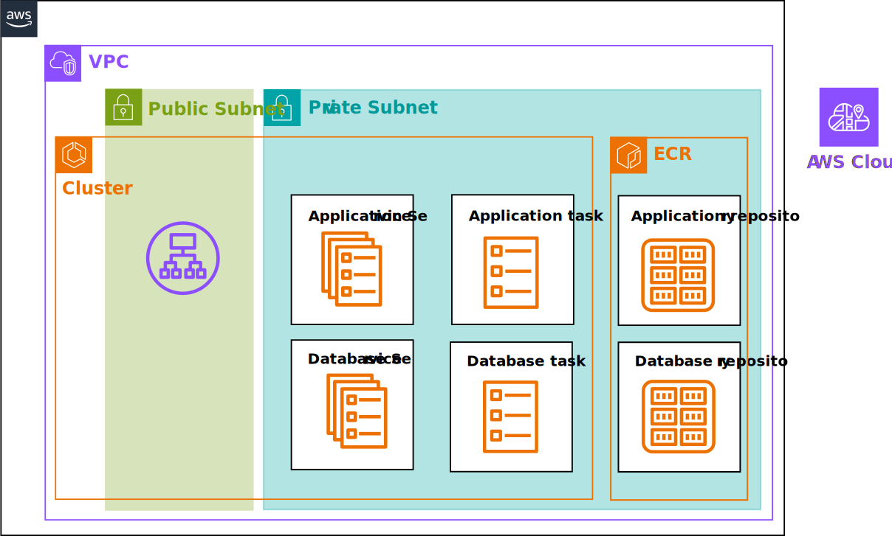

# Elastic Container Service (ECS) Stack

## Usage

1. Create a secret name `grafana-postgres-on-ecs` in AWS Secret Manager with the following secrets.

| Key | Value |
| --- | --- |
| `DATABASE_USERNAME` | Username for database (e.g. postgres) |
| `DATABASE_PASSWORD` | Password for database (e.g. passw0rd) |
| `DATABASE_HOST` | `database.service.local` |
| `DATABASE_NAME` | Name of the database (e.g. sylla) |

2. We need to have two ECR repositories `grafana` and `postgres`. Set the variables 
set the `repository_name` variable in `modules/grafana/variables.tf` and `modules/postgres/variables.tf` 
respectively. The subdirectory `repo/ops/repository` contains the 
terraform code to create the ECR repositories.

3. Add your public key to `main.tf` to allow ssh access to the EC2 instances.

## References 
* [How to Deploy an AWS ECS Cluster with Terraform](https://spacelift.io/blog/terraform-ecs)]